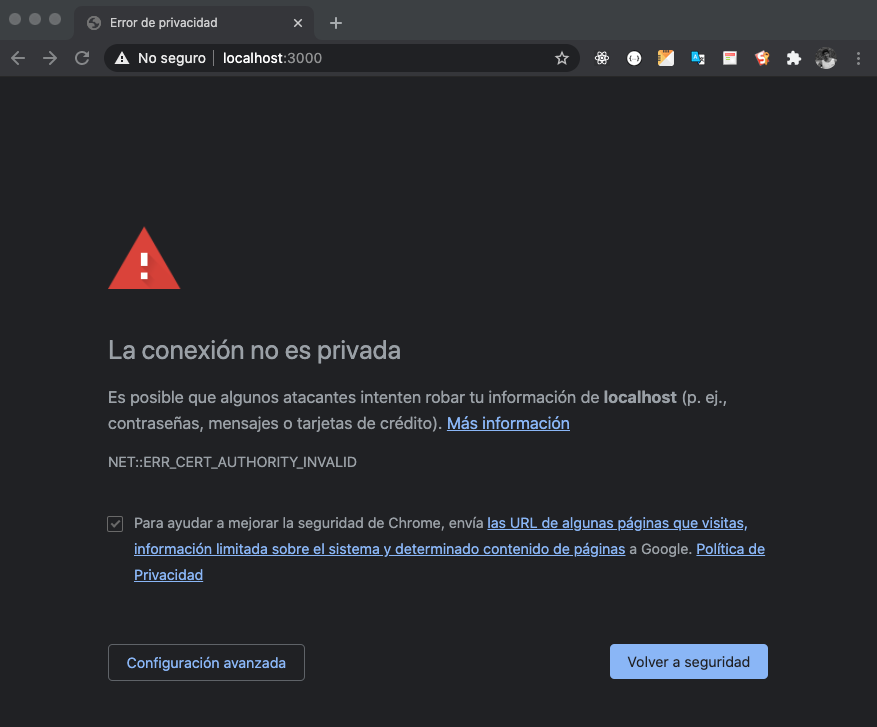
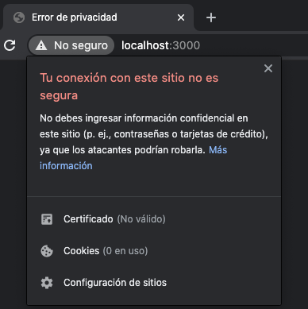
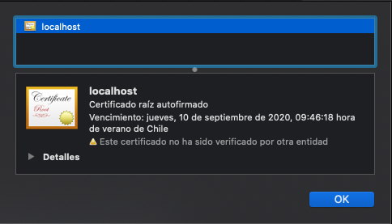
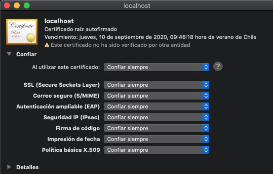

## Configurar Https
Para trabajara rn forma local

## Creación del certificado
En la raíz del proyecto ejecutar
```
openssl req -x509 -newkey rsa:2048 -keyout keytmp.pem -out cert.pem -days 365
```
Luego solicitará ingresar los datos para crear el certificado
```
Enter PEM pass phrase:  esta-es-mi-frase
Verifying - Enter PEM pass phrase:  esta-es-mi-frase
-----
Country Name (2 letter code) []: Cl
State or Province Name (full name) []:Santiago
Locality Name (eg, city) []:Santiago
Organization Name (eg, company) []:GCA Desarrollos Tecnologicos
Organizational Unit Name (eg, section) []:
Common Name (eg, fully qualified host name) []:
Email Address []:mortega@apgca.cl
```

Al finalizar creará una archivo que contiene el certificado `keytmp.pem` 

Para habilitar el certificado debemos ejecutar
```
openssl rsa -in keytmp.pem -out key.pem
```
Se solicitará la frase ingresada al momento de la creación
`Enter pass phrase for keytmp.pem:`


## Actualizar package.json
Debemos setear la variable de ambiente HTTPS en truee

Modificar
```
"start": "react-scripts start"
```

Por 
```
"start": "export HTTPS=true&&SSL_CRT_FILE=cert.pem&&SSL_KEY_FILE=key.pem react-scripts start",
```


## Ejecutar proyecto

Ejecutando `npm start` o `yarn start` se levantará nuestro proyecto

## Error con el certificado en sistemas operativos Mac Osx 

Los navegadores devuelven el siguiente error



Al seleccionar el certificado aparecerá:



Seleccionar el ítem "Certificado (No Válido" y aparecerá la siguiente pantalla



Tomar el icono del certificado y arrastrarlo al escritorio


Ejecutar desde el escritorio el certificado generado


Al ejecutar el certificado descargado se debe abrir la aplicación `llaveros`, una vez dentro buscar el certificado que dice 'localhost' y hacer dos click sobre él.
›
Una vez abierto el certificado debemos hacer click en la opción `Confiar` en la opción `Al utilizar este certificado` seleccionar la opción `Confiar siempre`.



Cerrar llaveros y ahora a disfrutar de tú aplicación corriendo en https.


